# Country dashboards

AfDB · AU STATAFRIC · STG17 · PARTICIPANTS' WORK

What the country teams built during the week, published by themselves and open to everyone. Every dashboard is interactive and bilingual.

18 countries46 dashboards3 laboratories

## Jump to a country {: #acces }

<nav class="stg-flags">
<a href="#pays-bwa"> Botswana</a>
<a href="#pays-bdi"> Burundi</a>
<a href="#pays-civ"> Côte d'Ivoire</a>
<a href="#pays-egy"> Egypt</a>
<a href="#pays-eth"> Ethiopia</a>
<a href="#pays-gmb"> Gambia</a>
<a href="#pays-gha"> Ghana</a>
<a href="#pays-ken"> Kenya</a>
<a href="#pays-mdg"> Madagascar</a>
<a href="#pays-mar"> Morocco</a>
<a href="#pays-nam"> Namibia</a>
<a href="#pays-nga"> Nigeria</a>
<a href="#pays-rwa"> Rwanda</a>
<a href="#pays-sen"> Senegal</a>
<a href="#pays-som"> Somalia</a>
<a href="#pays-tza"> Tanzania</a>
<a href="#pays-tun"> Tunisia</a>
<a href="#pays-zwe"> Zimbabwe</a>
</nav>

##  Botswana {: #pays-bwa }

<article>
<a class="shot" href="https://loxionmlk.github.io/stg17-dashboard/" target="_blank" rel="noopener">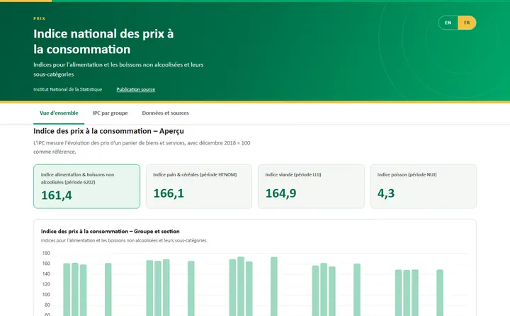</a>
<h3>From statistical release to dashboard</h3>

Published by National Institute of Statistics. 1 indicator · 1 view · 5 areas

<dl class="kpis">
<dt>Food & non‑alcoholic beverages index</dt><dd>161.4</dd>
<dt>Bread & cereals index</dt><dd>166.1</dd>
<dt>Meat index</dt><dd>164.9</dd>
<dt>Fish index</dt><dd>4.3</dd>
</dl>

<a class="md-button" href="https://loxionmlk.github.io/stg17-dashboard/" target="_blank" rel="noopener">Open the dashboard</a>

</article>
<article>
<a class="shot" href="https://loxionmlk.github.io/connectivity-bwa/" target="_blank" rel="noopener">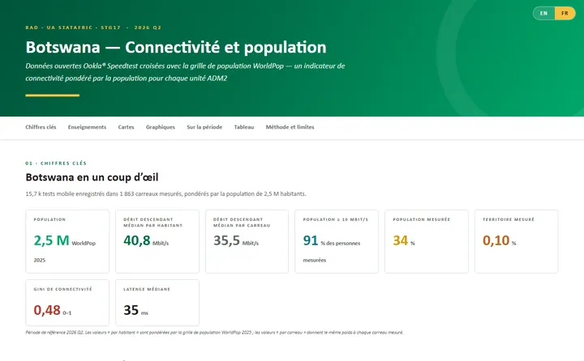</a>
<h3>Connectivity and population</h3>

Ookla Speedtest open data set against population, by administrative unit. 22 charts · interactive maps.

<dl class="kpis">
<dt>Population</dt><dd>2.5 MWorldPop 2025</dd>
<dt>Median download per person</dt><dd>40.8Mbps</dd>
<dt>Median download per tile</dt><dd>35.5Mbps</dd>
<dt>Population ≥ 10 Mbps</dt><dd>91% of measured</dd>
</dl>

<a class="md-button" href="https://loxionmlk.github.io/connectivity-bwa/" target="_blank" rel="noopener">Open the dashboard</a>

</article>
<article>

<h3>Night-time lights</h3>

Subnational indicators derived from VIIRS night-time lights. 10 charts · 8 analytical sections.

<dl class="kpis">
<dt>Sum of Lights</dt><dd>21,5442024 · nW·cm⁻²·sr⁻¹</dd>
<dt>Annual growth of SoL</dt><dd>+8.2%per year, 2015–2024</dd>
<dt>Population</dt><dd>2,400,650WorldPop</dd>
<dt>People in unlit inhabited cells</dt><dd>1,091,64748.7% of inhabited population</dd>
</dl>

<a class="md-button" href="https://loxionmlk.github.io/ntl-bwa-stg17/" target="_blank" rel="noopener">Open the dashboard</a>

</article>

##  Burundi {: #pays-bdi }

<article>
<a class="shot" href="https://proonihorimbere-del.github.io/stg17-dashboard/" target="_blank" rel="noopener">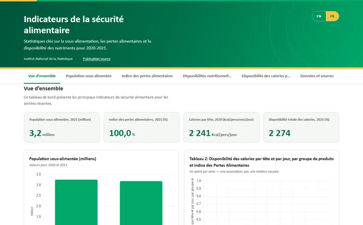</a>
<h3>From statistical release to dashboard</h3>

Published by National Institute of Statistics. 4 indicators · 4 views · 8 areas

<dl class="kpis">
<dt>Undernourished population, 2021 (million)</dt><dd>3.19million</dd>
<dt>Food loss index, 2021 (%)</dt><dd>99.97%</dd>
<dt>Calories per capita, 2020 (kcal/person/day)</dt><dd>2241kcal/person/day</dd>
<dt>Total calorie availability, 2021 (%)</dt><dd>2274</dd>
</dl>

<a class="md-button" href="https://proonihorimbere-del.github.io/stg17-dashboard/" target="_blank" rel="noopener">Open the dashboard</a>

</article>
<article>

<h3>Connectivity and population</h3>

Ookla Speedtest open data set against population, by administrative unit. 22 charts · interactive maps.

<dl class="kpis">
<dt>Population</dt><dd>14,1 MWorldPop 2025</dd>
<dt>Débit descendant médian par habitant</dt><dd>6,0Mbit/s</dd>
<dt>Débit descendant médian par carreau</dt><dd>9,9Mbit/s</dd>
<dt>Population ≥ 10 Mbit/s</dt><dd>39% des personnes mesurées</dd>
</dl>

<a class="md-button" href="https://proonihorimbere-del.github.io/connectivity-bdi/" target="_blank" rel="noopener">Open the dashboard</a>

</article>
<article>
<a class="shot" href="https://proonihorimbere-del.github.io/ntl-bdi-stg17/" target="_blank" rel="noopener">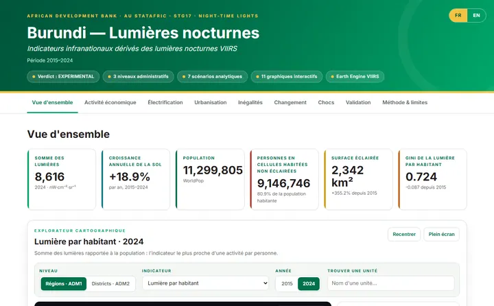</a>
<h3>Night-time lights</h3>

Subnational indicators derived from VIIRS night-time lights. 10 charts · 8 analytical sections.

<dl class="kpis">
<dt>Sum of Lights</dt><dd>8,6162024 · nW·cm⁻²·sr⁻¹</dd>
<dt>Annual growth of SoL</dt><dd>+18.9%par an, 2015–2024</dd>
<dt>Population</dt><dd>11,299,805WorldPop</dd>
<dt>People in unlit inhabited cells</dt><dd>9,146,746</dd>
</dl>

<a class="md-button" href="https://proonihorimbere-del.github.io/ntl-bdi-stg17/" target="_blank" rel="noopener">Open the dashboard</a>

</article>

##  Côte d'Ivoire {: #pays-civ }

<article>
<a class="shot" href="https://kingkin7.github.io/stg17-dashboard/" target="_blank" rel="noopener">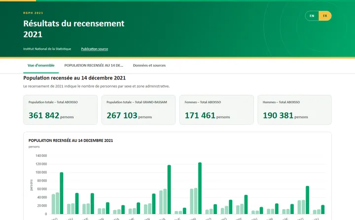</a>
<h3>From statistical release to dashboard</h3>

Published by National Institute of Statistics. 1 indicator · 1 view · 18 areas

<dl class="kpis">
<dt>Total population – Total ABOISSO</dt><dd>361842persons</dd>
<dt>Total population – Total GRAND-BASSAM</dt><dd>267103persons</dd>
<dt>Females – Total ABOISSO</dt><dd>171461persons</dd>
<dt>Males – Total ABOISSO</dt><dd>190381persons</dd>
</dl>

<a class="md-button" href="https://kingkin7.github.io/stg17-dashboard/" target="_blank" rel="noopener">Open the dashboard</a>

</article>
<article>

<h3>Connectivity and population</h3>

Ookla Speedtest open data set against population, by administrative unit. 22 charts · interactive maps.

<dl class="kpis">
<dt>Population</dt><dd>31.6 MWorldPop 2025</dd>
<dt>Median download per person</dt><dd>28.3Mbps</dd>
<dt>Median download per tile</dt><dd>26.5Mbps</dd>
<dt>Population ≥ 10 Mbps</dt><dd>89% of measured</dd>
</dl>

<a class="md-button" href="https://kingkin7.github.io/connectivity-civ/" target="_blank" rel="noopener">Open the dashboard</a>

</article>
<article>
<a class="shot" href="https://kingkin7.github.io/ntl-civ-stg17/" target="_blank" rel="noopener">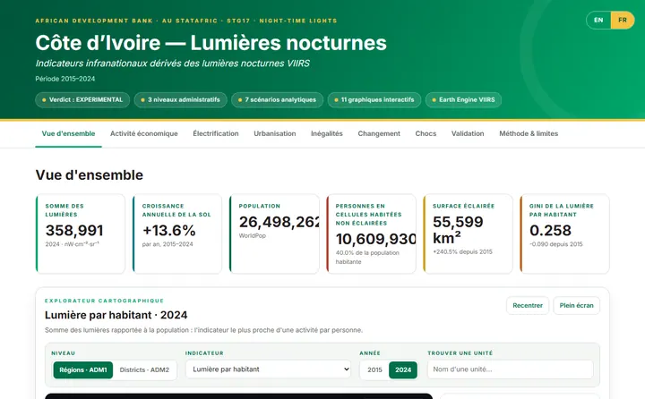</a>
<h3>Night-time lights</h3>

Subnational indicators derived from VIIRS night-time lights. 10 charts · 8 analytical sections.

<dl class="kpis">
<dt>Sum of Lights</dt><dd>358,9912024 · nW·cm⁻²·sr⁻¹</dd>
<dt>Annual growth of SoL</dt><dd>+13.6%per year, 2015–2024</dd>
<dt>Population</dt><dd>26,498,262WorldPop</dd>
<dt>People in unlit inhabited cells</dt><dd>10,609,93040.0% of inhabited population</dd>
</dl>

<a class="md-button" href="https://kingkin7.github.io/ntl-civ-stg17/" target="_blank" rel="noopener">Open the dashboard</a>

</article>

##  Egypt {: #pays-egy }

<article>
<a class="shot" href="https://emanelmaasarawi.github.io/stg17-dashboard/" target="_blank" rel="noopener">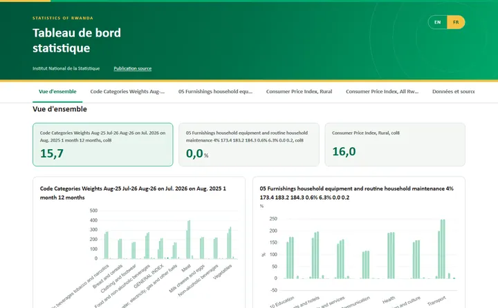</a>
<h3>From statistical release to dashboard</h3>

Published by National Institute of Statistics. 4 indicators · 4 views · 20 areas

<dl class="kpis">
<dt>Code Categories Weights Aug-25 Jul-26 Aug-26…</dt><dd>15.7</dd>
<dt>Consumer Price Index, Rural, col8</dt><dd>16.0</dd>
</dl>

<a class="md-button" href="https://emanelmaasarawi.github.io/stg17-dashboard/" target="_blank" rel="noopener">Open the dashboard</a>

</article>
<article>

<h3>Connectivity and population</h3>

Ookla Speedtest open data set against population, by administrative unit. 22 charts · interactive maps.

<dl class="kpis">
<dt>Population</dt><dd>117.3 MWorldPop 2025</dd>
<dt>Median download per person</dt><dd>35.1Mbps</dd>
<dt>Median download per tile</dt><dd>34.8Mbps</dd>
<dt>Population ≥ 10 Mbps</dt><dd>90% of measured</dd>
</dl>

<a class="md-button" href="https://emanelmaasarawi.github.io/connectivity-egy/" target="_blank" rel="noopener">Open the dashboard</a>

</article>
<article>
<a class="shot" href="https://emanelmaasarawi.github.io/ntl-egy-stg17/" target="_blank" rel="noopener">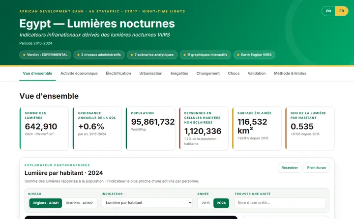</a>
<h3>Night-time lights</h3>

Subnational indicators derived from VIIRS night-time lights. 10 charts · 8 analytical sections.

<dl class="kpis">
<dt>Sum of Lights</dt><dd>642,9102024 · nW·cm⁻²·sr⁻¹</dd>
<dt>Annual growth of SoL</dt><dd>+0.6%per year, 2015–2024</dd>
<dt>Population</dt><dd>95,861,732WorldPop</dd>
<dt>People in unlit inhabited cells</dt><dd>1,120,3361.2% of inhabited population</dd>
</dl>

<a class="md-button" href="https://emanelmaasarawi.github.io/ntl-egy-stg17/" target="_blank" rel="noopener">Open the dashboard</a>

</article>

##  Ethiopia {: #pays-eth }

<article>
<a class="shot" href="https://abate2025.github.io/stg17-dashboard/" target="_blank" rel="noopener">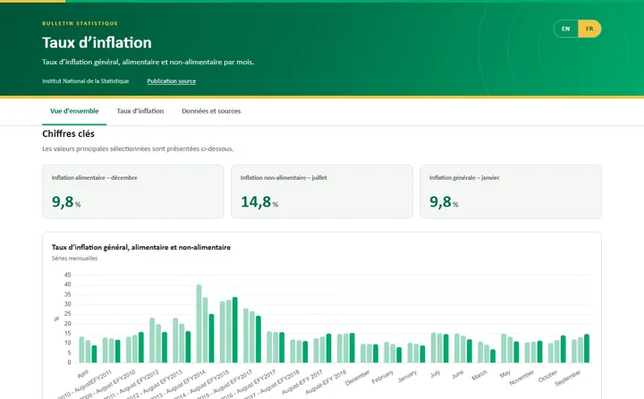</a>
<h3>From statistical release to dashboard</h3>

Published by National Institute of Statistics. 1 indicator · 1 view · 22 areas

<dl class="kpis">
<dt>Food inflation – December</dt><dd>9.8%</dd>
<dt>Non‑Food inflation – July</dt><dd>14.8%</dd>
<dt>General inflation – January</dt><dd>9.8%</dd>
</dl>

<a class="md-button" href="https://abate2025.github.io/stg17-dashboard/" target="_blank" rel="noopener">Open the dashboard</a>

</article>
<article>

<h3>Connectivity and population</h3>

Ookla Speedtest open data set against population, by administrative unit. 22 charts · interactive maps.

<dl class="kpis">
<dt>Population</dt><dd>133.4 MWorldPop 2025</dd>
<dt>Median download per person</dt><dd>17.1Mbps</dd>
<dt>Median download per tile</dt><dd>16.9Mbps</dd>
<dt>Population ≥ 10 Mbps</dt><dd>62% of measured</dd>
</dl>

<a class="md-button" href="https://abate2025.github.io/connectivity-eth/" target="_blank" rel="noopener">Open the dashboard</a>

</article>
<article>
<a class="shot" href="https://abate2025.github.io/ntl-eth-stg17/" target="_blank" rel="noopener">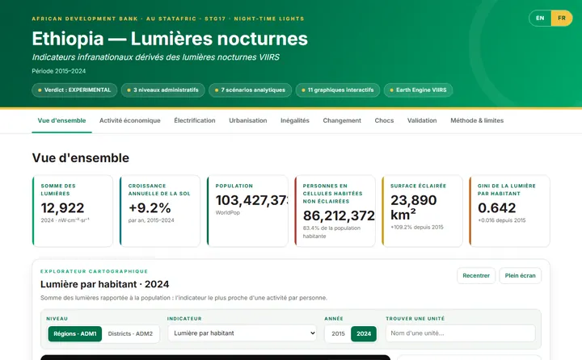</a>
<h3>Night-time lights</h3>

Subnational indicators derived from VIIRS night-time lights. 10 charts · 8 analytical sections.

<dl class="kpis">
<dt>Sum of Lights</dt><dd>12,9222024 · nW·cm⁻²·sr⁻¹</dd>
<dt>Annual growth of SoL</dt><dd>+9.2%per year, 2015–2024</dd>
<dt>Population</dt><dd>103,427,373WorldPop</dd>
<dt>People in unlit inhabited cells</dt><dd>86,212,37283.4% of inhabited population</dd>
</dl>

<a class="md-button" href="https://abate2025.github.io/ntl-eth-stg17/" target="_blank" rel="noopener">Open the dashboard</a>

</article>

##  Gambia {: #pays-gmb }

<article>
<a class="shot" href="https://929213.github.io/stg17-dashboard/" target="_blank" rel="noopener">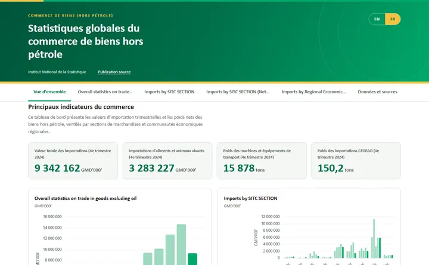</a>
<h3>From statistical release to dashboard</h3>

Published by National Institute of Statistics. 4 indicators · 4 views · 23 areas

<dl class="kpis">
<dt>Overall import value (4th QTR 2024)</dt><dd>9342162GMD'000'</dd>
<dt>Food & live animals imports (4th QTR 2024)</dt><dd>3283227GMD'000'</dd>
<dt>Machinery & transport equipment weight (4th…</dt><dd>15878tons</dd>
<dt>ECOWAS import weight (4th QTR 2024)</dt><dd>150.161tons</dd>
</dl>

<a class="md-button" href="https://929213.github.io/stg17-dashboard/" target="_blank" rel="noopener">Open the dashboard</a>

</article>
<article>
<a class="shot" href="https://929213.github.io/connectivity-gmb/" target="_blank" rel="noopener">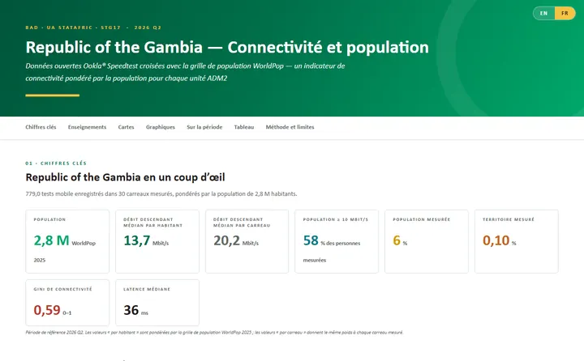</a>
<h3>Connectivity and population</h3>

Ookla Speedtest open data set against population, by administrative unit. 22 charts · interactive maps.

<dl class="kpis">
<dt>Population</dt><dd>2.8 MWorldPop 2025</dd>
<dt>Median download per person</dt><dd>13.7Mbps</dd>
<dt>Median download per tile</dt><dd>20.2Mbps</dd>
<dt>Population ≥ 10 Mbps</dt><dd>58% of measured</dd>
</dl>

<a class="md-button" href="https://929213.github.io/connectivity-gmb/" target="_blank" rel="noopener">Open the dashboard</a>

</article>
<article>
<a class="shot" href="https://929213.github.io/ntl-gmb-stg17/" target="_blank" rel="noopener">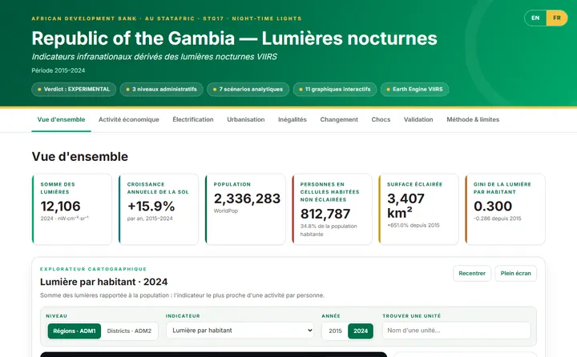</a>
<h3>Night-time lights</h3>

Subnational indicators derived from VIIRS night-time lights. 10 charts · 8 analytical sections.

<dl class="kpis">
<dt>Sum of Lights</dt><dd>12,1062024 · nW·cm⁻²·sr⁻¹</dd>
<dt>Annual growth of SoL</dt><dd>+15.9%per year, 2015–2024</dd>
<dt>Population</dt><dd>2,336,283WorldPop</dd>
<dt>People in unlit inhabited cells</dt><dd>812,78734.8% of inhabited population</dd>
</dl>

<a class="md-button" href="https://929213.github.io/ntl-gmb-stg17/" target="_blank" rel="noopener">Open the dashboard</a>

</article>

##  Ghana {: #pays-gha }

<article>

<h3>Connectivity and population</h3>

Ookla Speedtest open data set against population, by administrative unit. 22 charts · interactive maps.

<dl class="kpis">
<dt>Population</dt><dd>34.6 MWorldPop 2025</dd>
<dt>Median download per person</dt><dd>19.6Mbps</dd>
<dt>Median download per tile</dt><dd>19.2Mbps</dd>
<dt>Population ≥ 10 Mbps</dt><dd>68% of measured</dd>
</dl>

<a class="md-button" href="https://doraboadi.github.io/connectivity-gha/" target="_blank" rel="noopener">Open the dashboard</a>

</article>
<article>

<h3>Night-time lights</h3>

Subnational indicators derived from VIIRS night-time lights. 10 charts · 8 analytical sections.

<dl class="kpis">
<dt>Sum of Lights</dt><dd>607,5332024 · nW·cm⁻²·sr⁻¹</dd>
<dt>Annual growth of SoL</dt><dd>+18.4%per year, 2015–2024</dd>
<dt>Population</dt><dd>32,917,020WorldPop</dd>
<dt>People in unlit inhabited cells</dt><dd>9,819,13829.8% of inhabited population</dd>
</dl>

<a class="md-button" href="https://doraboadi.github.io/ntl-gha-stg17/" target="_blank" rel="noopener">Open the dashboard</a>

</article>

##  Kenya {: #pays-ken }

<article>
<a class="shot" href="https://serahmwikalindunda.github.io/CIPI-Dashboard/" target="_blank" rel="noopener">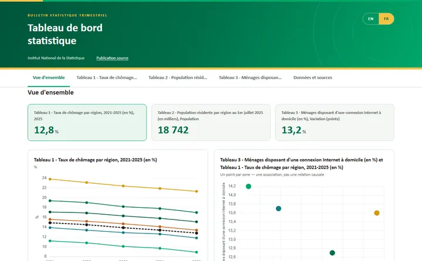</a>
<h3>From statistical release to dashboard</h3>

Published by National Institute of Statistics. 3 indicators · 3 views · 7 areas

<dl class="kpis">
<dt>Tableau 1 - Taux de chômage par région…</dt><dd>12.8%</dd>
<dt>Tableau 2 - Population résidente par région…</dt><dd>18742.0</dd>
<dt>Tableau 3 - Ménages disposant d'une connexion…</dt><dd>13.2%</dd>
</dl>

<a class="md-button" href="https://serahmwikalindunda.github.io/CIPI-Dashboard/" target="_blank" rel="noopener">Open the dashboard</a>

</article>
<article>
<a class="shot" href="https://serahmwikalindunda.github.io/connectivity-ken/" target="_blank" rel="noopener">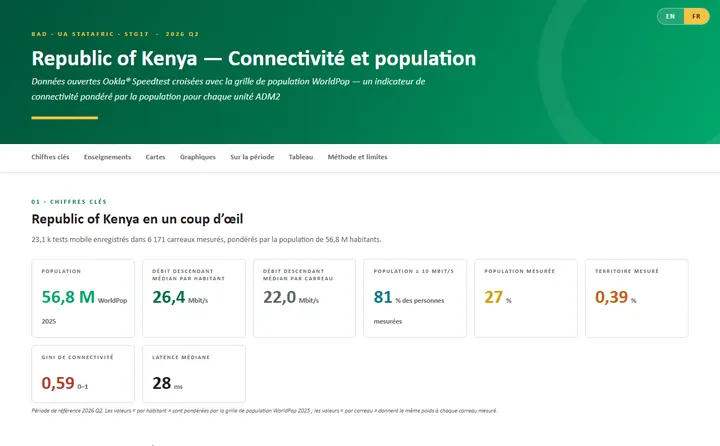</a>
<h3>Connectivity and population</h3>

Ookla Speedtest open data set against population, by administrative unit. 22 charts · interactive maps.

<dl class="kpis">
<dt>Population</dt><dd>56.8 MWorldPop 2025</dd>
<dt>Median download per person</dt><dd>26.4Mbps</dd>
<dt>Median download per tile</dt><dd>22.0Mbps</dd>
<dt>Population ≥ 10 Mbps</dt><dd>81% of measured</dd>
</dl>

<a class="md-button" href="https://serahmwikalindunda.github.io/connectivity-ken/" target="_blank" rel="noopener">Open the dashboard</a>

</article>
<article>
<a class="shot" href="https://serahmwikalindunda.github.io/ntl-ken-stg17/" target="_blank" rel="noopener">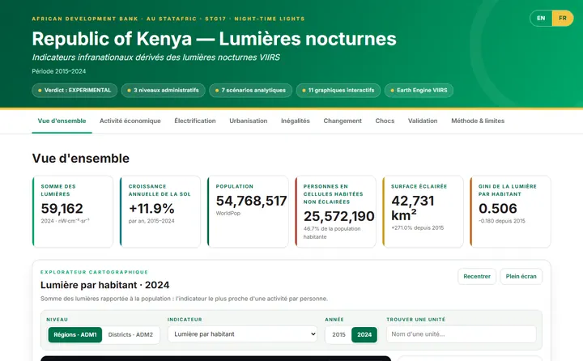</a>
<h3>Night-time lights</h3>

Subnational indicators derived from VIIRS night-time lights. 10 charts · 8 analytical sections.

<dl class="kpis">
<dt>Sum of Lights</dt><dd>59,1622024 · nW·cm⁻²·sr⁻¹</dd>
<dt>Annual growth of SoL</dt><dd>+11.9%per year, 2015–2024</dd>
<dt>Population</dt><dd>54,768,517WorldPop</dd>
<dt>People in unlit inhabited cells</dt><dd>25,572,19046.7% of inhabited population</dd>
</dl>

<a class="md-button" href="https://serahmwikalindunda.github.io/ntl-ken-stg17/" target="_blank" rel="noopener">Open the dashboard</a>

</article>

##  Madagascar {: #pays-mdg }

<article>
<a class="shot" href="https://ranne2.github.io/connectivity-mdg/" target="_blank" rel="noopener">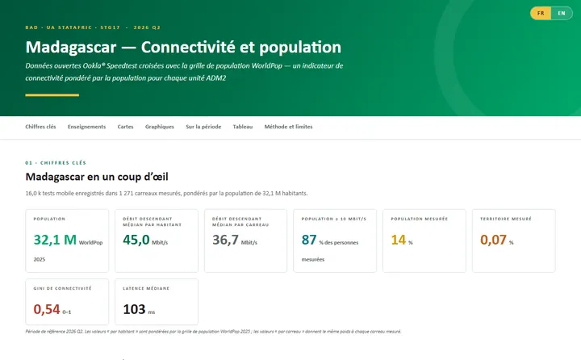</a>
<h3>Connectivity and population</h3>

Ookla Speedtest open data set against population, by administrative unit. 22 charts · interactive maps.

<dl class="kpis">
<dt>Population</dt><dd>32,1 MWorldPop 2025</dd>
<dt>Débit descendant médian par habitant</dt><dd>45,0Mbit/s</dd>
<dt>Débit descendant médian par carreau</dt><dd>36,7Mbit/s</dd>
<dt>Population ≥ 10 Mbit/s</dt><dd>87% des personnes mesurées</dd>
</dl>

<a class="md-button" href="https://ranne2.github.io/connectivity-mdg/" target="_blank" rel="noopener">Open the dashboard</a>

</article>

##  Morocco {: #pays-mar }

<article>
<a class="shot" href="https://musttaleb2017.github.io/stg17-dashboard/" target="_blank" rel="noopener">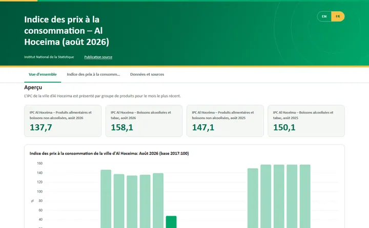</a>
<h3>From statistical release to dashboard</h3>

Published by National Institute of Statistics. 1 indicator · 1 view · 2 areas

<dl class="kpis">
<dt>CPI Al Hoceima – Food & non‑alcoholic drinks…</dt><dd>137.7</dd>
<dt>CPI Al Hoceima – Alcoholic drinks & tobacco…</dt><dd>158.1</dd>
<dt>CPI Al Hoceima – Food & non‑alcoholic drinks…</dt><dd>147.1</dd>
<dt>CPI Al Hoceima – Alcoholic drinks & tobacco…</dt><dd>150.1</dd>
</dl>

<a class="md-button" href="https://musttaleb2017.github.io/stg17-dashboard/" target="_blank" rel="noopener">Open the dashboard</a>

</article>
<article>
<a class="shot" href="https://musttaleb2017.github.io/connectivity-mar/" target="_blank" rel="noopener">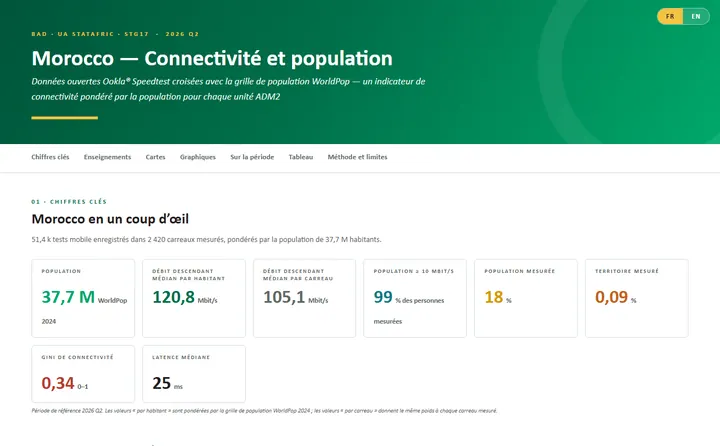</a>
<h3>Connectivity and population</h3>

Ookla Speedtest open data set against population, by administrative unit. 22 charts · interactive maps.

<dl class="kpis">
<dt>Population</dt><dd>37,7 MWorldPop 2024</dd>
<dt>Débit descendant médian par habitant</dt><dd>120,8Mbit/s</dd>
<dt>Débit descendant médian par carreau</dt><dd>105,1Mbit/s</dd>
<dt>Population ≥ 10 Mbit/s</dt><dd>99% des personnes mesurées</dd>
</dl>

<a class="md-button" href="https://musttaleb2017.github.io/connectivity-mar/" target="_blank" rel="noopener">Open the dashboard</a>

</article>
<article>
<a class="shot" href="https://musttaleb2017.github.io/ntl-mar-stg17/" target="_blank" rel="noopener">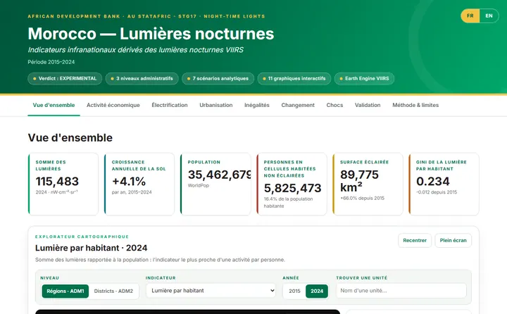</a>
<h3>Night-time lights</h3>

Subnational indicators derived from VIIRS night-time lights. 10 charts · 8 analytical sections.

<dl class="kpis">
<dt>Sum of Lights</dt><dd>115,4832024 · nW·cm⁻²·sr⁻¹</dd>
<dt>Annual growth of SoL</dt><dd>+4.1%par an, 2015–2024</dd>
<dt>Population</dt><dd>35,462,679WorldPop</dd>
<dt>People in unlit inhabited cells</dt><dd>5,825,473</dd>
</dl>

<a class="md-button" href="https://musttaleb2017.github.io/ntl-mar-stg17/" target="_blank" rel="noopener">Open the dashboard</a>

</article>

##  Namibia {: #pays-nam }

<article>
<a class="shot" href="https://henokskielek1.github.io/ntl-nam-stg17/" target="_blank" rel="noopener">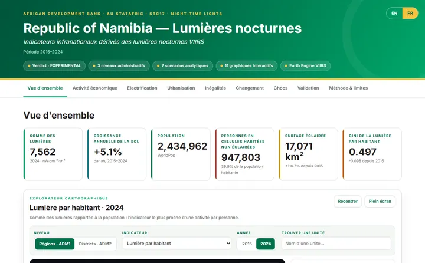</a>
<h3>Night-time lights</h3>

Subnational indicators derived from VIIRS night-time lights. 10 charts · 8 analytical sections.

<dl class="kpis">
<dt>Sum of Lights</dt><dd>7,5622024 · nW·cm⁻²·sr⁻¹</dd>
<dt>Annual growth of SoL</dt><dd>+5.1%per year, 2015–2024</dd>
<dt>Population</dt><dd>2,434,962WorldPop</dd>
<dt>People in unlit inhabited cells</dt><dd>947,80339.9% of inhabited population</dd>
</dl>

<a class="md-button" href="https://henokskielek1.github.io/ntl-nam-stg17/" target="_blank" rel="noopener">Open the dashboard</a>

</article>

##  Nigeria {: #pays-nga }

<article>
<a class="shot" href="https://benabolaji.github.io/connectivity-nga/" target="_blank" rel="noopener">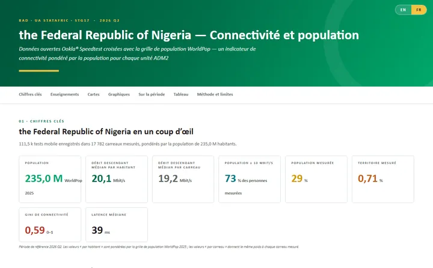</a>
<h3>Connectivity and population</h3>

Ookla Speedtest open data set against population, by administrative unit. 22 charts · interactive maps.

<dl class="kpis">
<dt>Population</dt><dd>235.0 MWorldPop 2025</dd>
<dt>Median download per person</dt><dd>20.1Mbps</dd>
<dt>Median download per tile</dt><dd>19.2Mbps</dd>
<dt>Population ≥ 10 Mbps</dt><dd>73% of measured</dd>
</dl>

<a class="md-button" href="https://benabolaji.github.io/connectivity-nga/" target="_blank" rel="noopener">Open the dashboard</a>

</article>
<article>
<a class="shot" href="https://benabolaji.github.io/ntl-nga-stg17/" target="_blank" rel="noopener">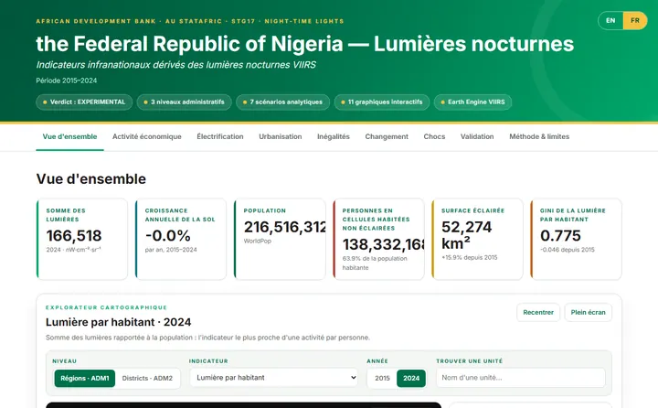</a>
<h3>Night-time lights</h3>

Subnational indicators derived from VIIRS night-time lights. 10 charts · 8 analytical sections.

<dl class="kpis">
<dt>Sum of Lights</dt><dd>166,5182024 · nW·cm⁻²·sr⁻¹</dd>
<dt>Annual growth of SoL</dt><dd>-0.0%per year, 2015–2024</dd>
<dt>Population</dt><dd>216,516,312WorldPop</dd>
<dt>People in unlit inhabited cells</dt><dd>138,332,16863.9% of inhabited population</dd>
</dl>

<a class="md-button" href="https://benabolaji.github.io/ntl-nga-stg17/" target="_blank" rel="noopener">Open the dashboard</a>

</article>

##  Rwanda {: #pays-rwa }

<article>
<a class="shot" href="https://dusjbos2.github.io/stg17-dashboard/" target="_blank" rel="noopener">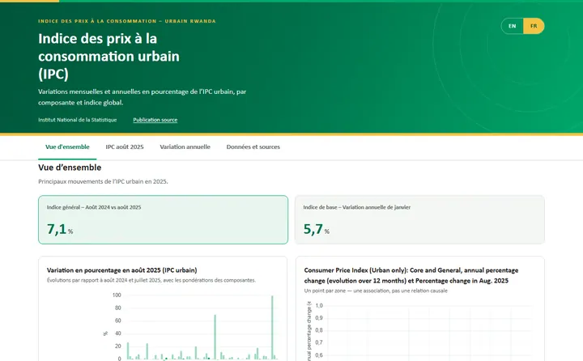</a>
<h3>From statistical release to dashboard</h3>

Published by National Institute of Statistics. 2 indicators · 2 views · 19 areas

<dl class="kpis">
<dt>General index – August 2024 vs August 2025</dt><dd>7.1%</dd>
<dt>Core index – January annual change</dt><dd>5.7%</dd>
</dl>

<a class="md-button" href="https://dusjbos2.github.io/stg17-dashboard/" target="_blank" rel="noopener">Open the dashboard</a>

</article>
<article>

<h3>Connectivity and population</h3>

Ookla Speedtest open data set against population, by administrative unit. 22 charts · interactive maps.

<dl class="kpis">
<dt>Population</dt><dd>14.3 MWorldPop 2025</dd>
<dt>Median download per person</dt><dd>25.2Mbps</dd>
<dt>Median download per tile</dt><dd>23.8Mbps</dd>
<dt>Population ≥ 10 Mbps</dt><dd>80% of measured</dd>
</dl>

<a class="md-button" href="https://dusjbos2.github.io/first_connectivity-rwa/" target="_blank" rel="noopener">Open the dashboard</a>

</article>
<article>

<h3>Night-time lights</h3>

Subnational indicators derived from VIIRS night-time lights. 10 charts · 8 analytical sections.

<dl class="kpis">
<dt>Sum of Lights</dt><dd>41,5042024 · nW·cm⁻²·sr⁻¹</dd>
<dt>Annual growth of SoL</dt><dd>+17.7%per year, 2015–2024</dd>
<dt>Population</dt><dd>13,479,184WorldPop</dd>
<dt>People in unlit inhabited cells</dt><dd>8,171,15260.6% of inhabited population</dd>
</dl>

<a class="md-button" href="https://dusjbos2.github.io/ntl-rwa-stg17/" target="_blank" rel="noopener">Open the dashboard</a>

</article>

##  Senegal {: #pays-sen }

<article>
<a class="shot" href="https://bigmoussa.github.io/stg17-dashboard/" target="_blank" rel="noopener">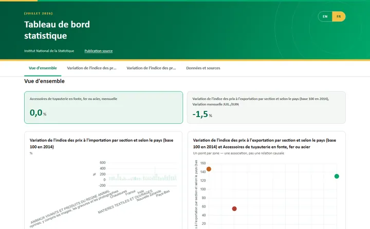</a>
<h3>From statistical release to dashboard</h3>

Published by National Institute of Statistics. 2 indicators · 2 views · 42 areas

<dl class="kpis">
<dt>Change in export price index by section and…</dt><dd>-1.5%</dd>
</dl>

<a class="md-button" href="https://bigmoussa.github.io/stg17-dashboard/" target="_blank" rel="noopener">Open the dashboard</a>

</article>
<article>

<h3>Connectivity and population</h3>

Ookla Speedtest open data set against population, by administrative unit. 22 charts · interactive maps.

<dl class="kpis">
<dt>Population</dt><dd>18,6 MWorldPop 2025</dd>
<dt>Débit descendant médian par habitant</dt><dd>30,2Mbit/s</dd>
<dt>Débit descendant médian par carreau</dt><dd>25,2Mbit/s</dd>
<dt>Population ≥ 10 Mbit/s</dt><dd>91% des personnes mesurées</dd>
</dl>

<a class="md-button" href="https://bigmoussa.github.io/connectivity-sen/" target="_blank" rel="noopener">Open the dashboard</a>

</article>
<article>
<a class="shot" href="https://bigmoussa.github.io/ntl-sen-stg17/" target="_blank" rel="noopener">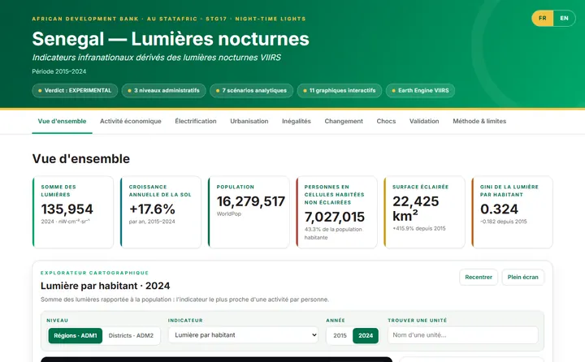</a>
<h3>Night-time lights</h3>

Subnational indicators derived from VIIRS night-time lights. 10 charts · 8 analytical sections.

<dl class="kpis">
<dt>Sum of Lights</dt><dd>135,9542024 · nW·cm⁻²·sr⁻¹</dd>
<dt>Annual growth of SoL</dt><dd>+17.6%par an, 2015–2024</dd>
<dt>Population</dt><dd>16,279,517WorldPop</dd>
<dt>People in unlit inhabited cells</dt><dd>7,027,015</dd>
</dl>

<a class="md-button" href="https://bigmoussa.github.io/ntl-sen-stg17/" target="_blank" rel="noopener">Open the dashboard</a>

</article>

##  Somalia {: #pays-som }

<article>
<a class="shot" href="https://hassan-2026.github.io/stg17-dashboard/" target="_blank" rel="noopener">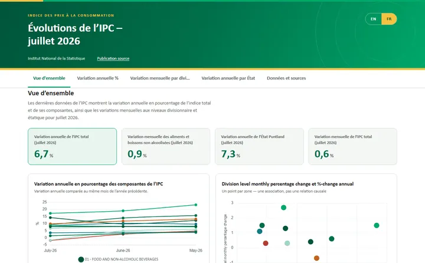</a>
<h3>From statistical release to dashboard</h3>

Published by National Institute of Statistics. 3 indicators · 3 views · 20 areas

<dl class="kpis">
<dt>CPI total annual change (July 2026)</dt><dd>6.7%</dd>
<dt>Food and non‑alcoholic beverages monthly…</dt><dd>0.9%</dd>
<dt>Puntland state annual change (July 2026)</dt><dd>7.3%</dd>
<dt>CPI total monthly change (July 2026)</dt><dd>0.6%</dd>
</dl>

<a class="md-button" href="https://hassan-2026.github.io/stg17-dashboard/" target="_blank" rel="noopener">Open the dashboard</a>

</article>
<article>
<a class="shot" href="https://hassan-2026.github.io/ntl-som-stg17/" target="_blank" rel="noopener">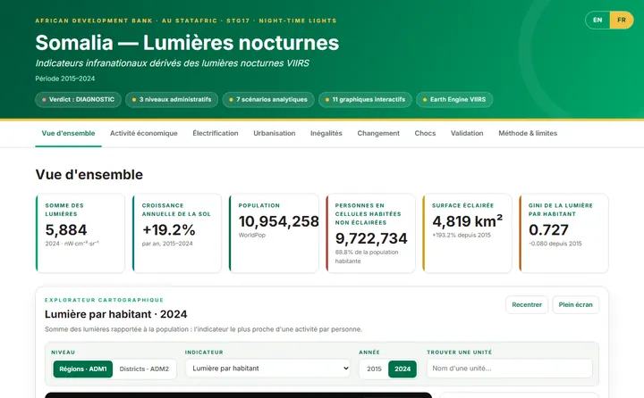</a>
<h3>Night-time lights</h3>

Subnational indicators derived from VIIRS night-time lights. 10 charts · 8 analytical sections.

<dl class="kpis">
<dt>Sum of Lights</dt><dd>5,8842024 · nW·cm⁻²·sr⁻¹</dd>
<dt>Annual growth of SoL</dt><dd>+19.2%per year, 2015–2024</dd>
<dt>Population</dt><dd>10,954,258WorldPop</dd>
<dt>People in unlit inhabited cells</dt><dd>9,722,73488.8% of inhabited population</dd>
</dl>

<a class="md-button" href="https://hassan-2026.github.io/ntl-som-stg17/" target="_blank" rel="noopener">Open the dashboard</a>

</article>

##  Tanzania {: #pays-tza }

<article>
<a class="shot" href="https://munirmdee1980.github.io/connectivity-tza/" target="_blank" rel="noopener">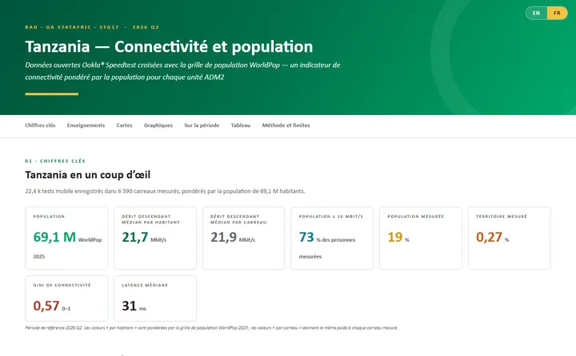</a>
<h3>Connectivity and population</h3>

Ookla Speedtest open data set against population, by administrative unit. 22 charts · interactive maps.

<dl class="kpis">
<dt>Population</dt><dd>69.1 MWorldPop 2025</dd>
<dt>Median download per person</dt><dd>21.7Mbps</dd>
<dt>Median download per tile</dt><dd>21.9Mbps</dd>
<dt>Population ≥ 10 Mbps</dt><dd>73% of measured</dd>
</dl>

<a class="md-button" href="https://munirmdee1980.github.io/connectivity-tza/" target="_blank" rel="noopener">Open the dashboard</a>

</article>
<article>
<a class="shot" href="https://munirmdee1980.github.io/ntl-tza-stg17/" target="_blank" rel="noopener">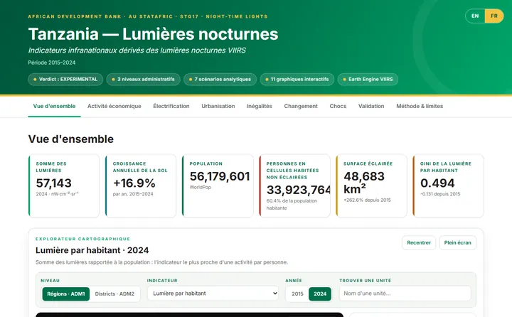</a>
<h3>Night-time lights</h3>

Subnational indicators derived from VIIRS night-time lights. 10 charts · 8 analytical sections.

<dl class="kpis">
<dt>Sum of Lights</dt><dd>57,1432024 · nW·cm⁻²·sr⁻¹</dd>
<dt>Annual growth of SoL</dt><dd>+16.9%per year, 2015–2024</dd>
<dt>Population</dt><dd>56,179,601WorldPop</dd>
<dt>People in unlit inhabited cells</dt><dd>33,923,76460.4% of inhabited population</dd>
</dl>

<a class="md-button" href="https://munirmdee1980.github.io/ntl-tza-stg17/" target="_blank" rel="noopener">Open the dashboard</a>

</article>

##  Tunisia {: #pays-tun }

<article>
<a class="shot" href="https://hatemsedghiani.github.io/stg17-dashboard_v1/" target="_blank" rel="noopener">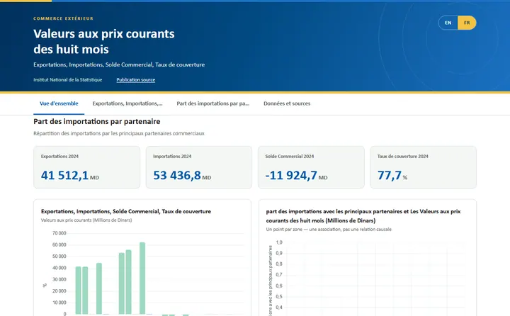</a>
<h3>From statistical release to dashboard</h3>

Published by National Institute of Statistics. 2 indicators · 2 views · 9 areas

<dl class="kpis">
<dt>Exports 2024</dt><dd>41512.1Millions of Dinars</dd>
<dt>Imports 2024</dt><dd>53436.8Millions of Dinars</dd>
<dt>Commercial Balance 2024</dt><dd>-11924.7Millions of Dinars</dd>
<dt>Coverage Rate 2024</dt><dd>77.7%</dd>
</dl>

<a class="md-button" href="https://hatemsedghiani.github.io/stg17-dashboard_v1/" target="_blank" rel="noopener">Open the dashboard</a>

</article>
<article>
<a class="shot" href="https://hatemsedghiani.github.io/connectivity-10-tun/" target="_blank" rel="noopener">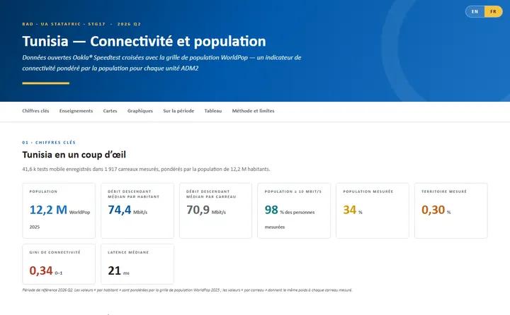</a>
<h3>Connectivity and population</h3>

Ookla Speedtest open data set against population, by administrative unit. 22 charts · interactive maps.

<dl class="kpis">
<dt>Population</dt><dd>12.2 MWorldPop 2025</dd>
<dt>Median download per person</dt><dd>74.4Mbps</dd>
<dt>Median download per tile</dt><dd>70.9Mbps</dd>
<dt>Population ≥ 10 Mbps</dt><dd>98% of measured</dd>
</dl>

<a class="md-button" href="https://hatemsedghiani.github.io/connectivity-10-tun/" target="_blank" rel="noopener">Open the dashboard</a>

</article>
<article>
<a class="shot" href="https://hatemsedghiani.github.io/ntl-tun-stg17/" target="_blank" rel="noopener">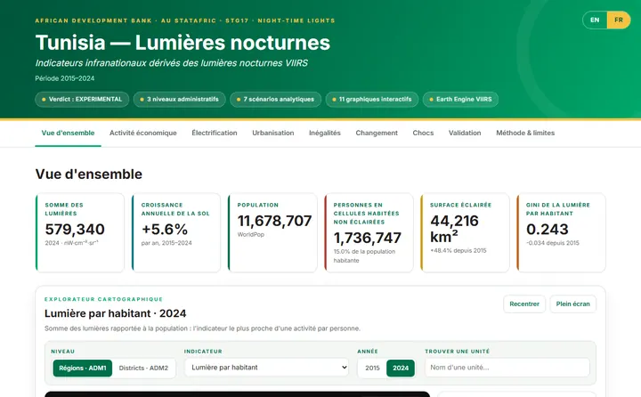</a>
<h3>Night-time lights</h3>

Subnational indicators derived from VIIRS night-time lights. 10 charts · 8 analytical sections.

<dl class="kpis">
<dt>Sum of Lights</dt><dd>579,3402024 · nW·cm⁻²·sr⁻¹</dd>
<dt>Annual growth of SoL</dt><dd>+5.6%per year, 2015–2024</dd>
<dt>Population</dt><dd>11,678,707WorldPop</dd>
<dt>People in unlit inhabited cells</dt><dd>1,736,74715.0% of inhabited population</dd>
</dl>

<a class="md-button" href="https://hatemsedghiani.github.io/ntl-tun-stg17/" target="_blank" rel="noopener">Open the dashboard</a>

</article>

##  Zimbabwe {: #pays-zwe }

<article>
<a class="shot" href="https://bc2429git.github.io/stg17-dashboard/" target="_blank" rel="noopener">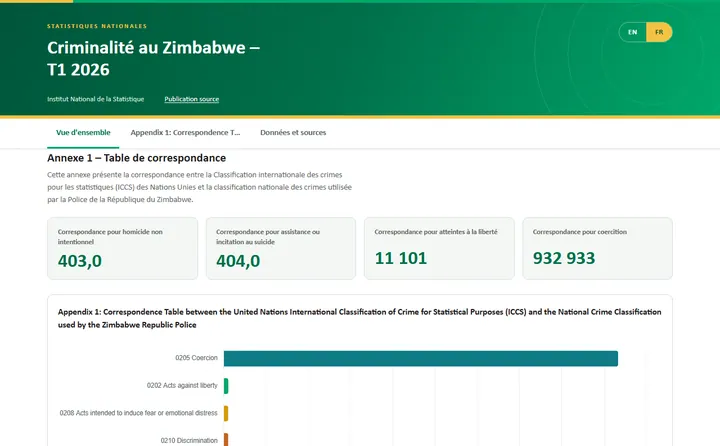</a>
<h3>From statistical release to dashboard</h3>

Published by National Institute of Statistics. 1 indicator · 1 view · 6 areas

<dl class="kpis">
<dt>Correspondence for Non‑intentional homicide</dt><dd>403.0</dd>
<dt>Correspondence for Assisting or instigating…</dt><dd>404.0</dd>
<dt>Correspondence for Acts against liberty</dt><dd>11101.0</dd>
<dt>Correspondence for Coercion</dt><dd>932933.0</dd>
</dl>

<a class="md-button" href="https://bc2429git.github.io/stg17-dashboard/" target="_blank" rel="noopener">Open the dashboard</a>

</article>
<article>

<h3>Connectivity and population</h3>

Ookla Speedtest open data set against population, by administrative unit. 22 charts · interactive maps.

<dl class="kpis">
<dt>Population</dt><dd>16.8 MWorldPop 2025</dd>
<dt>Median download per person</dt><dd>25.2Mbps</dd>
<dt>Median download per tile</dt><dd>30.8Mbps</dd>
<dt>Population ≥ 10 Mbps</dt><dd>66% of measured</dd>
</dl>

<a class="md-button" href="https://bc2429git.github.io/connectivity-zwe/" target="_blank" rel="noopener">Open the dashboard</a>

</article>
<article>

<h3>Night-time lights</h3>

Subnational indicators derived from VIIRS night-time lights. 10 charts · 8 analytical sections.

<dl class="kpis">
<dt>Sum of Lights</dt><dd>22,1182024 · nW·cm⁻²·sr⁻¹</dd>
<dt>Annual growth of SoL</dt><dd>+6.9%per year, 2015–2024</dd>
<dt>Population</dt><dd>14,348,118WorldPop</dd>
<dt>People in unlit inhabited cells</dt><dd>8,730,23460.9% of inhabited population</dd>
</dl>

<a class="md-button" href="https://bc2429git.github.io/ntl-zwe-stg17/" target="_blank" rel="noopener">Open the dashboard</a>

</article>

Page built from liens.txt.

