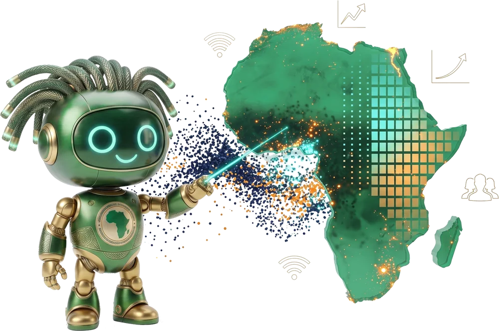

---
hide:
  - navigation
---

DI4A
Data Innovation for Africa

Africa Information Highway · Banque africaine de développement

# Enjeux émergents, pratiques émergentes

Un atelier de renforcement des capacités mené conjointement avec
<b>STATAFRIC (Union africaine)</b>, dans le cadre du <b>Groupe technique spécialisé 17</b> · SHaSA II

Innover dans la chaîne de valeur des données — intelligence artificielle,
grands modèles de langage et mégadonnées pour la statistique officielle.

{ .di4a-robot }

:material-calendar-range: <b>28 septembre – 2 octobre 2026</b>
:material-map-marker: Kigali, Rwanda
:material-translate: Anglais et français

5jours 27 heures de contact

12laboratoires pratiques

2langues, depuis une source unique

[:material-rocket-launch: Commencez ici — les comptes à créer](before/accounts.md){ .md-button .md-button--primary }
[:material-calendar-week: Voir la semaine](week/index.md){ .md-button }

## Commencez ici

### :material-clipboard-check: Avant votre arrivée
Les comptes à créer, et où placer les clés qu'ils délivrent. Aucun n'est payant,
et Earth Engine comporte un délai d'approbation qu'il vaut mieux engager tôt.

[Comptes à créer →](before/accounts.md)

### :material-calendar-week: La semaine
Cinq jours, session par session, avec la présentation et les notebooks rattachés à
chacune. Générée depuis l'agenda lui-même : elle ne peut pas diverger.

[Jour 1 →](day1/index.md)

### :material-flask: Les laboratoires
Douze laboratoires pratiques, chacun en **anglais et en français**, chacun avec
son environnement, son livrable et un chemin de repli documenté.

[Registre des laboratoires →](labs/index.md)

## Ce qui distingue cet atelier

**Le registre des pays couvre tous les États membres de l'Union africaine.** À
partir d'un code ISO3, `stg17.countries` résout l'emprise géographique, la zone
UTM, les tuiles satellitaires et les codes WorldPop — calculés plutôt que
tabulés. Le laboratoire Ookla du Jour 3 est bâti dessus : fixez votre propre pays
en tête de ce notebook et la même chaîne produit votre indicateur national.

**Rien ne dépend d'une étape non testée.** Chaque laboratoire dispose d'un chemin
de repli qui fonctionne réellement : extraits pays pré-découpés fournis par
l'équipe d'animation, variante Earth Engine ne téléchargeant rien, voie DuckDB
quand le cluster Elasticsearch est injoignable, et un pays de référence préparé
de bout en bout pour qu'aucune équipe ne perde une journée sur un fichier
manquant.

**La déclaration de limites fait partie du livrable.** Un indicateur indirect
publié sans exposé honnête de ce qu'il ne peut pas soutenir n'est pas un produit
statistique. Le Jour 4 transforme cette déclaration en document formel, étayé par
des preuves et validé contre vos propres chiffres infranationaux officiels.

## D'où vient cet atelier

Le Conseil exécutif du trentième Sommet de l'Union africaine a adopté la SHaSA II
en janvier 2018 comme stratégie continentale de développement de la statistique
en Afrique. Elle est mise en œuvre par des Groupes techniques spécialisés, un
pour chacun de ses dix-huit domaines prioritaires. Le **STG17** est le groupe
responsable des enjeux émergents — mégadonnées, données ouvertes et, de plus en
plus, intelligence artificielle.

La première réunion annuelle, convoquée à Kigali en septembre 2025 par la Banque
africaine de développement en tant que Secrétariat du STG17 avec l'UA STATAFRIC,
a identifié cinq obstacles freinant l'usage systématique des sources de données
alternatives. Cet atelier est bâti autour d'eux, et constitue un instrument
opérationnel direct du **paquet de travail 4.2** du Plan d'action 2025-2030.

| Obstacle identifié à Kigali | Réponse de cet atelier |
|---|---|
| Obstacles d'accès aux nouvelles sources — cadres juridiques, coût, exploitabilité | Modèles d'accès et de partenariat avec les détenteurs privés (Jour 3) ; travail direct sur une source à licence ouverte et ses restrictions (Ookla, CC BY-NC-SA) ; licences, DOI et citation (Jour 5) |
| Absence de méthodologies harmonisées | Chaque équipe pays exécute la même chaîne documentée sur les mêmes trois sources ; tous les notebooks aboutissent dans une seule organisation GitHub publique |
| Questions ouvertes sur la qualité des sources alternatives | Biais de couverture et de sélection des sources non probabilistes (Jour 3) ; validation de l'indicateur NTL contre les statistiques infranationales officielles (Jour 4) |
| Faiblesses de l'informatique et de l'infrastructure mégadonnées des INS | Fondamentaux de l'infrastructure IA, modélisation des coûts et arbitrages de souveraineté (Jour 1) ; technologies mégadonnées et justification de la complexité ajoutée (Jour 3) |
| Lacunes en ressources humaines, compétences et métiers de la donnée | L'atelier lui-même, encadré par une auto-évaluation initiale et finale alimentant le cadre de compétences |
| Besoin d'échanges structurés entre offices | Échange d'expériences pays au Jour 1 et présentations pays au Jour 5 |

[Correspondance complète thème ↔ Plan d'action →](resources/action-plan.md)

## Objectifs pédagogiques

À l'issue de l'atelier, les participants seront capables de :

- Situer les concepts fondamentaux de l'IA les uns par rapport aux autres — IA,
  LLM, ingénierie de prompt, RAG, affinage, systèmes agentiques, agents et MCP —
  et expliquer où chacun s'insère dans la chaîne de valeur statistique.
- Évaluer l'infrastructure réellement nécessaire à un INS pour exécuter des
  charges IA : calcul, stockage, service, coût et arbitrages de souveraineté.
- Concevoir, construire et optimiser des prompts, et choisir le bon modèle et le
  bon fournisseur d'inférence pour une tâche statistique donnée.
- Déployer des LLM sur un portefeuille de cas d'usage professionnels : code,
  rédaction de rapports, présentations, graphiques et identité visuelle, analyse
  documentaire.
- Acquérir, traiter et publier des données non traditionnelles — Ookla Speedtest,
  WorldPop et lumières nocturnes — comme indicateurs statistiques infranationaux.
- Construire un produit analytique reproductible et le publier sur GitHub, avec
  méthodes, limites et licences documentées.
- Apprendre de ce que les pays pairs ont déjà accompli, et identifier au moins une
  opportunité de collaboration ou de réutilisation pour leur propre office.

!!! tip "Langue de travail"

    Les sessions se déroulent en anglais avec interprétation simultanée. **Tout le
    matériel des laboratoires — chaque notebook, chaque présentation et l'intégralité
    de ce site — existe en anglais et en français.** Utilisez le sélecteur de
    langue dans l'en-tête, ou le lien :material-web: en haut de n'importe quel
    notebook.
